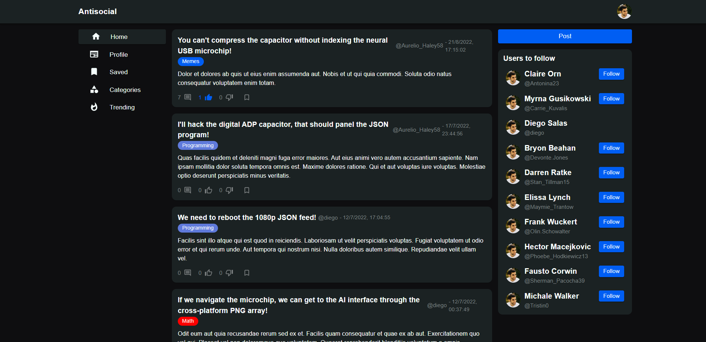

# Antisocial

This project simulates a social media app. It's inspired on Twitter and has a lot of functionalities. This repo only contains the front-end side for this system. See also [Health Care API](https://github.com/diegosalasmartinez/antisocial-api) to get access to the back-end project.

This project uses [Communication icons created by Freepik - Flaticon](https://www.flaticon.com/free-icons/communication).

If you see a error on the system or no data displayed on the screen, please contacte me: diesalasmart@gmail.com.



## Basic Usage

You can visit the project on [Antisocial](https://diegosalas-antisocial.web.app).

## Instalation

1. Clone the project to your computer.

2. Install all the dependencies of the project

``` bash
npm install
```

3. Create a `.env` file with the following content:

```javascript
REACT_APP_SERVER_URL = your backend url. e.g. http://localhost:5000
```

4. Start the project

``` bash
npm start
```

5. Navigate to [http://localhost:3000](http://localhost:3000). The app will automatically reload if you change any of the source files.

## App Info

### Author

[Diego Salas](https://www.linkedin.com/in/diego-alejandro-salas-martinez/)

### Version

1.0.0

### License

This project is licensed under the MIT License.

